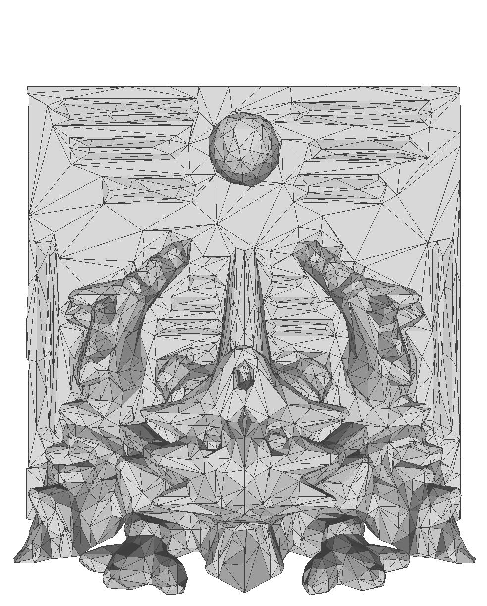
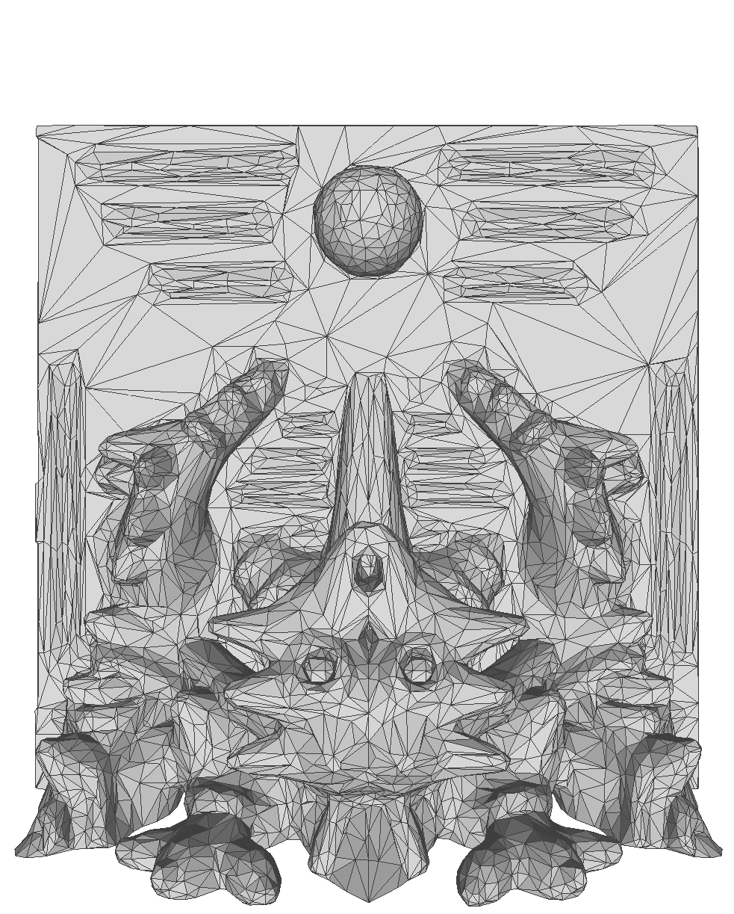
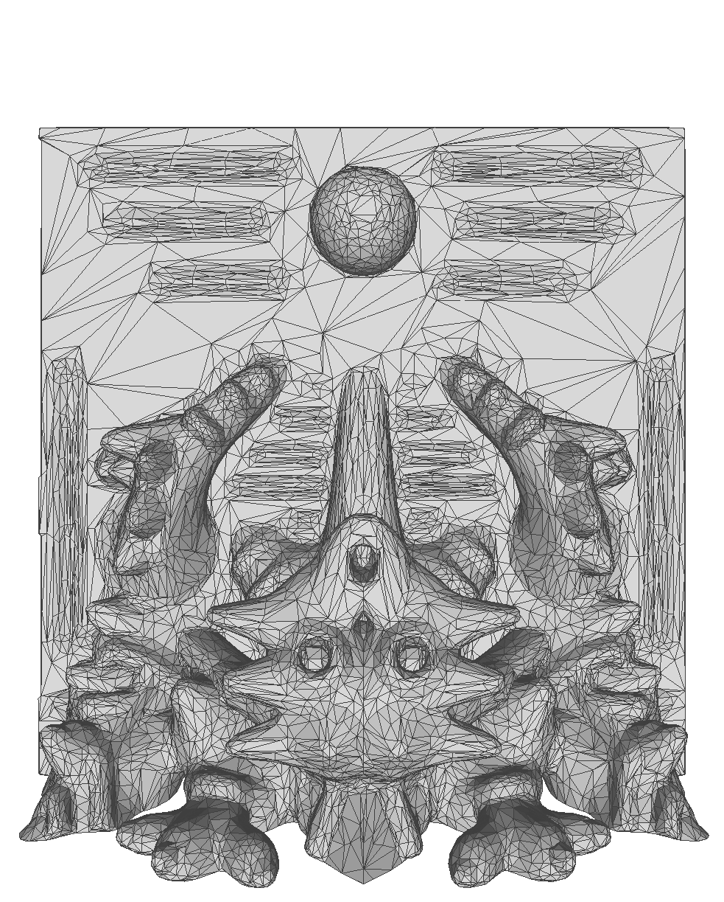

# Fast-Quadric-Mesh-Simplification

this go implementaton is fast and versatil. thanks for [Sven FORSTMANN](https://github.com/sp4cerat/Fast-Quadric-Mesh-Simplification/tree/master). 
* memory efficient,
* free and for
* high quality

5000 trias (692.6494ms)    |  10000 trias (769.2492ms) | 20000 trias (747.3038ms)
:-------------------------:|:-------------------------:|:-------------------------:
    |   |  

## Compiling and Usage
```shell
go build
./main.exe --input wall.obj --output wall20000.obj --target 2000
```

## Acknowledge
* https://github.com/sp4cerat/Fast-Quadric-Mesh-Simplification/tree/master
* github.com/udhos/gwob
* many good golang libs

